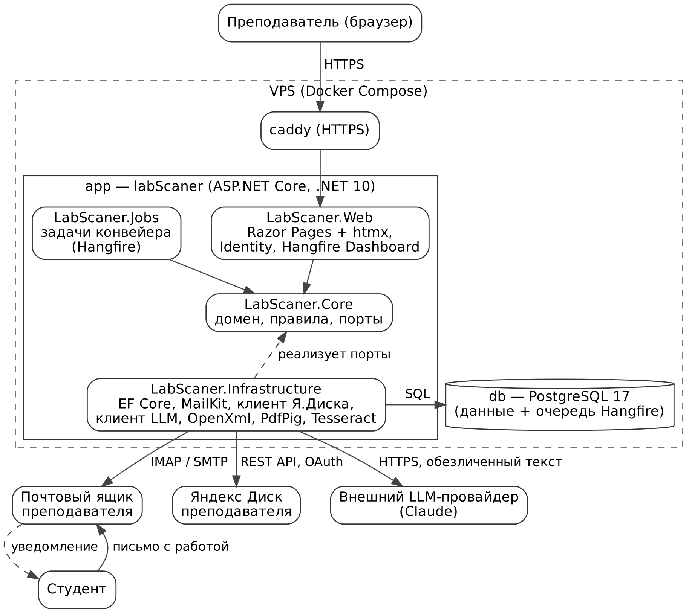
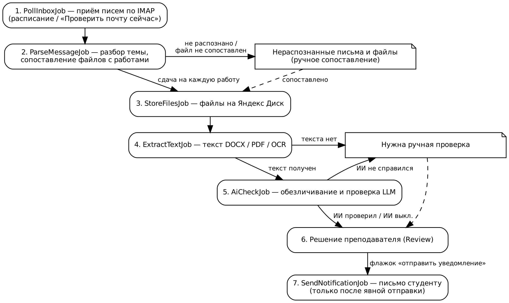

---
system:
- СИСТЕМА ПРИЁМА И ПЕРВИЧНОЙ ПРОВЕРКИ
- СТУДЕНЧЕСКИХ РАБОТ
- LABSCANER
title:
- Технический паспорт
year: 2026
approve:
- УТВЕРЖДАЮ
- [уточнить: должность]
- [уточнить: организация]
- ___________________ [уточнить: И.О. Фамилия]
terms:
- БД — база данных
- ИИ — искусственный интеллект; в Системе — проверка работы с помощью LLM
- КР — курсовая работа
- ЛР — лабораторная работа
- ПДн — персональные данные
- ПО — программное обеспечение
- ФИО — фамилия, имя, отчество
- ADR — Architecture Decision Record — запись об архитектурном решении
- API — Application Programming Interface — программный интерфейс
- CI/CD — Continuous Integration / Continuous Delivery — непрерывная интеграция и доставка
- DOCX — формат текстовых документов Microsoft Word (Office Open XML)
- EF Core — Entity Framework Core — ORM-библиотека платформы .NET
- HTTPS — HyperText Transfer Protocol Secure — защищённый протокол передачи гипертекста
- IMAP — Internet Message Access Protocol — протокол доступа к электронной почте
- JSON — JavaScript Object Notation — текстовый формат обмена структурированными данными
- LLM — Large Language Model — большая языковая модель
- OAuth — Open Authorization — протокол авторизации доступа к ресурсам
- OCR — Optical Character Recognition — оптическое распознавание символов
- ORM — Object-Relational Mapping — объектно-реляционное отображение
- PDF — Portable Document Format — формат электронных документов
- SMTP — Simple Mail Transfer Protocol — протокол отправки электронной почты
- VPS — Virtual Private Server — виртуальный выделенный сервер
---

# Общие сведения

## Наименование и обозначение

Полное наименование: «Система приёма и первичной проверки студенческих работ labScaner» (далее — Система).

Краткое наименование: labScaner.

## Назначение

Система предназначена для автоматизации приёма, раскладки и первичной проверки студенческих работ (ЛР и КР) с сохранением окончательного решения за преподавателем.

Система обеспечивает:

- приём писем студентов с вложениями PDF и DOCX из рабочего почтового ящика преподавателя по IMAP с отбором писем со сдачей работ;
- распознавание группы, предмета, студента и работы по теме письма;
- сохранение файлов работ в папки преподавателя на Яндекс Диске;
- проверку работы на соответствие заданию с помощью LLM и запись результата в журнал;
- ведение журнала группы: сдача и принятие ЛР, КР, экзамен или зачёт, автоматы;
- отправку студенту письма с результатом рассмотрения каждой работы — только после подтверждения преподавателем.

Основной принцип Системы: ИИ выполняет роль помощника-аудитора и предлагает оценку; решение принимает преподаватель. Ни одно письмо не отправляется студенту и ни одна итоговая оценка не выставляется без действия преподавателя (ADR-007).

## Пользователи и роли

Роли пользователей приведены в таблице [@tbl:roles].

Таблица: Роли пользователей Системы {#tbl:roles widths=23,39,38}
| Роль | Состав | Способ работы с Системой |
| Преподаватель | Несколько пользователей; у каждого свои предметы, почтовый ящик и Яндекс Диск | Веб-интерфейс с входом по паролю; видит только свои данные |
| Администратор | Один из преподавателей с дополнительными правами | Пользователи, общие справочники (группы, студенты, учебный календарь), настройки LLM, панель фоновых задач |
| Студент | Отправитель писем | Только электронная почта: отправляет работы, получает ответы; в интерфейс не входит |

## Исходные документы

Паспорт составлен на основании проектных материалов Системы:

- описание проекта и требования (docs/PROJECT.md);
- архитектура и модель данных (docs/ARCHITECTURE.md);
- журнал архитектурных решений ADR-001…ADR-027 (docs/DECISIONS.md);
- план работ (docs/ROADMAP.md);
- ревью макетов интерфейса (docs/design/DESIGN_REVIEW.md) от 03.10.2026.

Ссылки вида «F14» указывают на функциональные требования, «НФ3» — на нефункциональные требования документа docs/PROJECT.md, «ADR-011» — на решения docs/DECISIONS.md.

## Стадия создания

Система находится на стадии разработки: завершён этап 0 «Инфраструктура проекта», выполняется этап 1 «Макеты»: ревью и правки выполнены, недостающие макеты дорисованы, решения по приёму писем и вложениям приняты (ADR-022…025), идёт утверждение макетов. Программный код Системы не разработан. Этапы создания приведены в таблице [@tbl:stages].

Таблица: Этапы создания Системы {#tbl:stages widths=10,30,60}
| Этап | Наименование | Результат (критерий готовности) |
| 0 | Инфраструктура проекта | Требования, архитектура, ADR, репозиторий |
| 1 | Макеты | Утверждённые макеты экранов и состояний ячейки журнала |
| 2 | Скелет приложения | Развёртывание командой docker compose up, вход в Систему, сборка CI без ошибок |
| 3 | Справочники | Заведение предмета, группы из файла, отображение пустого журнала |
| 4 | Приём почты и хранение | Письмо из ящика за время не более 5 мин превращается в файл на Диске и ячейку журнала |
| 5 | Журнал и карточка сдачи | Ведение журнала полностью, без ИИ и уведомлений |
| 6 | ИИ-проверка | Стабильный результат на эталонном наборе работ |
| 7 | Уведомления | Письмо студенту уходит только после подтверждения преподавателя |
| 8 | Запуск | Работа на VPS, пилот на одной группе |

# Основные характеристики

## Функции Системы

Функции Системы и соответствующие требования приведены в таблице [@tbl:func].

Таблица: Функции Системы {#tbl:func widths=24,60,16}
| Функция | Содержание | Требования |
| Приём почты | Чтение рабочего ящика преподавателя по IMAP по расписанию (по умолчанию каждые 5 мин, отключаемо) и по кнопке «Проверить почту сейчас»; отбор писем со сдачей работ, прочие письма не сохраняются; ящик не изменяется; показ результата и статуса приёма | F1, F5, F6 |
| Разбор темы письма | Определение группы, предмета, студента и одной или нескольких работ; сопоставление каждого файла письма с работой; нераспознанные письма и файлы — в очередь ручного сопоставления | F2, F4 |
| Хранение файлов | Сохранение вложений PDF и DOCX на Яндекс Диск в папки предмета; прочие форматы не принимаются; повторная сдача — новая версия | F3, F7, F8 |
| Извлечение текста | DOCX, PDF с текстовым слоем, PDF без текста — локальное OCR | F9 |
| ИИ-проверка | Проверка по заданию и чек-листу, результат по JSON-схеме, предлагаемая оценка; отключаемо для предмета или работы | F10–F13 |
| Журнал группы | Статусы работ, оценки, КР и темы КР, экзамен или зачёт, автоматы, история комментариев, экспорт в Excel | F13a, F14, F16–F16b |
| Решение преподавателя | Карточка сдачи и быстрая отметка в ячейке журнала: «Лаба ОК», оценка, «На доработку», замечания | F15, F15a |
| Уведомления | Одно письмо на студента по предмету в семестре; отправка после предпросмотра и явного подтверждения | F17–F19 |
| Администрирование | Справочники, задания, подключения, шаблоны писем, пользователи | F20, F21 |
| Журналы системы | Журнал событий с лентой «Что ждёт от меня», журнал проверки работы | F22, F23 |

## Архитектура

### Общая схема

Система построена как модульный монолит: один процесс ASP.NET Core содержит веб-интерфейс и фоновые задачи Hangfire; данные и очередь задач хранятся в PostgreSQL. Взаимодействие компонентов Системы и внешних сервисов представлено на рисунке [@fig:arch].

{#fig:arch width=15}

### Состав программных компонентов

Программные компоненты Системы приведены в таблице [@tbl:comp].

Таблица: Программные компоненты Системы {#tbl:comp widths=28,72}
| Компонент | Назначение |
| LabScaner.Web | Веб-интерфейс Razor Pages, эндпоинты htmx для частичного обновления страниц, аутентификация и роли (ASP.NET Core Identity), панель Hangfire Dashboard (только для администратора) |
| LabScaner.Core | Предметная область: сущности, статусы, правила (срок, автомат, разбор темы), интерфейсы портов к внешним сервисам |
| LabScaner.Infrastructure | Реализации портов: EF Core и миграции БД, MailKit (IMAP, SMTP), клиент Яндекс Диска, клиент LLM, извлечение текста (OpenXml, PdfPig), OCR (Tesseract) |
| LabScaner.Jobs | Задачи конвейера обработки письма на Hangfire (допускается объединение с LabScaner.Infrastructure) |
| PostgreSQL 17 | Данные Системы и очередь фоновых задач Hangfire |

Внешние сервисы подключаются только через порты, объявленные в LabScaner.Core: IMailInbox, IMailSender, IFileStorage, ITextExtractor, IOcrEngine, ILlmClient, IClock. В тестах порты заменяются фейковыми реализациями.

### Структура решения

Структура исходного кода решения:

```
labScaner/
  src/
    LabScaner.Web/
    LabScaner.Core/
    LabScaner.Infrastructure/
    LabScaner.Jobs/
  tests/
    LabScaner.Core.Tests/
    LabScaner.Integration.Tests/
    LabScaner.E2E.Tests/
    fixtures/
  deploy/
  docs/
  .github/workflows/
```

Каталог tests содержит модульные тесты, интеграционные тесты с PostgreSQL в Testcontainers и фейковыми внешними сервисами, сквозные тесты Playwright и образцы писем (.eml), PDF и DOCX. Каталог deploy содержит docker-compose.yml, Caddyfile и .env.example.

### Разделение данных преподавателей

Данные изолированы по преподавателю глобальным фильтром запросов EF Core по полю teacher_id (ADR-016). Разделение данных приведено в таблице [@tbl:tenant].

Таблица: Принадлежность данных {#tbl:tenant widths=30,70}
| Принадлежность | Данные |
| Преподаватель | Предметы и всё, что к ним относится: предметы в семестре, работы, сдачи, решения, комментарии, уведомления; входящие письма; подключения (почтовый ящик IMAP/SMTP, токен Яндекс Диска); шаблоны писем; задачи «Что ждёт от меня» |
| Общие для Системы | Группы и студенты, учебный календарь (зачётная неделя, сессия), настройки LLM (адрес шлюза, ключ, модель, лимиты) |

Конвейер обрабатывает каждый подключённый почтовый ящик отдельно; предмет по письму ищется только среди предметов владельца ящика. Коды предметов уникальны в пределах преподавателя.

## Логика работы

### Конвейер обработки письма

Обработка письма выполняется последовательностью фоновых задач Hangfire. Состояние каждой сдачи хранится в БД, поэтому любой шаг повторяется без потери данных. Последовательность шагов представлена на рисунке [@fig:pipe], содержание шагов — в таблице [@tbl:pipe].

{#fig:pipe width=15}

Таблица: Шаги конвейера обработки письма {#tbl:pipe widths=6,25,43,26}
| № | Шаг | Вход → выход | Статус сдачи после шага |
| 1 | PollInboxJob | IMAP (новые письма по UID) → отбор писем со сдачей работ → InboxMessage и InboxAttachment (заголовки, вложения PDF и DOCX во временной папке Диска); прочие письма пропускаются | — |
| 2 | ParseMessageJob | Тема → группа, предмет, студент, набор работ; каждый файл → работа; по одной Submission на работу; несопоставленные файлы → «Нераспознанные» | Received / письмо Unrecognized или PartiallyParsed |
| 3 | StoreFilesJob | Временная папка → постоянная папка предмета; запись SubmissionFile | Stored |
| 4 | ExtractTextJob | DOCX — OpenXml; PDF — PdfPig; PDF без текста — растр и Tesseract | TextReady / NeedsManual |
| 5 | AiCheckJob | Обезличенный текст, задание, чек-лист → AiCheck; пропускается, если ИИ выключен | AiChecked / AiFailed / AwaitingReview |
| 6 | Решение преподавателя | Review: принято или на доработку, оценка, замечания, флажок «отправить уведомление» | Accepted / Returned |
| 7 | SendNotificationJob | Notification → SMTP, только после явной отправки преподавателем | — (отметка в журнале) |

Каждый шаг фиксируется в журнале проверки работы (ProcessingStep) со статусом (ожидает, выполняется, готово, ошибка, пропущен), временем начала и окончания, числом попыток и текстом ошибки.

Правила надёжности конвейера:

- обработка идемпотентна по заголовку Message-ID письма и номеру вложения: уникальные индексы в БД исключают дубли при повторном прогоне; каждая задача проверяет текущий статус перед выполнением (F5);
- почтовый ящик преподавателя не изменяется: флаги не ставятся, письма не перемещаются; прочитанные письма определяются по UIDVALIDITY, последнему UID и Message-ID (ADR-024);
- повторы с нарастающей задержкой выполняются только для временных сбоев: сеть, таймаут, недоступность почты, Яндекс Диска или LLM (ADR-021);
- отсутствие текста после OCR — штатная ситуация: статус «Нужна ручная проверка» без повторов;
- сбой одного внешнего сервиса не останавливает обработку остальных писем (НФ4).

### Отбор писем в рабочем ящике

Работы поступают на рабочий почтовый ящик преподавателя, в котором находится и остальная переписка (ADR-024). Система обрабатывает только письма со сдачей работ.

Письмо отбирается в обработку, если в нём есть вложение PDF или DOCX и выполняется хотя бы одно условие:

- в теме или имени вложения найдены группа или код предмета преподавателя;
- в теме или имени вложения есть признак работы («Лаб», «ЛР», «Лабораторная», «Курсов», «КР»);
- отправитель — известный адрес электронной почты студента.

Правила отбора:

- письмо с вложением PDF или DOCX, не прошедшее отбор, направляется на ручную выверку в «Нераспознанные» с причиной «не похоже на сдачу работы»; хранятся только отправитель, тема, дата, имена и размеры вложений; файлы загружаются из ящика, когда преподаватель отмечает письмо как сдачу работы; при отметке «не сдача» сведения о письме удаляются, кроме Message-ID;
- письма без вложений PDF и DOCX не сохраняются в БД, не отображаются в интерфейсе и не записываются в журнал событий; учитывается только их количество в истории запусков проверки почты;
- первый запуск читает почту с начала текущего семестра;
- в списках групп адресов электронной почты нет, поэтому адреса накапливаются по письмам: после распознавания письма и нахождения студента по ФИО адрес отправителя закрепляется за студентом автоматически, при ручном сопоставлении — с подтверждением преподавателя; адрес, с которого пришли работы разных студентов, автоматически не закрепляется.

### Разбор темы письма

Тема письма имеет формат (ADR-010):

```
{Группа} – {Предмет} – {ФИО} – Лаб №{номер}
{Группа} – {Предмет} – {ФИО} – Курсовая
```

Пример: «ИСТ-41 – КорпИС – Иванов Иван Иванович – Лаб №3».

Правила разбора:

- разделитель — тире «–», «—» или дефис «-» с пробелами с обеих сторон; дефис без пробелов относится к названию группы или двойной фамилии;
- префиксы «Re:», «Fwd:», «Fw:», «[SPAM]» отбрасываются; закодированные темы (Base64, windows-1251) декодируются;
- предмет определяется по коду и списку допустимых написаний без учёта регистра;
- варианты «Лаб №3», «Лаб № 3», «Лаб.3», «Лаб 3», «ЛР3», «Лабораторная 3» означают ЛР № 3; «Курсовая», «КР», «Курсовой проект» — КР;
- ФИО принимается полностью или в виде «Фамилия И.О.», буквы «ё» и «е» не различаются; студент ищется в указанной группе, при неудаче или неоднозначности — по адресу отправителя;
- при нарушении разделителей группа и предмет ищутся по словарю известных значений;
- письмо, которое не удалось разобрать, попадает в очередь «Нераспознанные» с указанием причины («не найден предмет», «студент не найден в группе», «нет вложений»); преподаватель сопоставляет его вручную (предмет → группа → студент → работа) или игнорирует.

Принимаются только вложения PDF и DOCX (ADR-023). Прочие вложения (DOC, ODT, исходные тексты программ, архивы, изображения) не сохраняются на Яндекс Диск и не проверяются: они фиксируются предупреждением в журнале событий и выводятся в карточке сдачи списком «Не принятые вложения». Письмо без вложений PDF и DOCX попадает в «Нераспознанные» с причиной «нет вложений PDF или DOCX».

Для КР в задании установлен шаблон «{Группа} – КорпИС – {ФИО} – КР - {Тема}»: окончание «- {Тема}» при разборе отделяется (ADR-025).

### Несколько работ в одном письме

Студент отправляет несколько ЛР одним письмом: одна тема, несколько файлов с разными именами (ADR-022). Каждая ЛР раскладывается, проверяется и принимается отдельно.

В теме работа указывается списком или диапазоном: «Лаб №3, 4», «Лаб №3 и 4», «ЛР 3,4,5», «Лаб 3-5», «Лаб №3, Лаб №4». Тема разбирается в набор номеров ЛР. Если номеров в теме нет, а группа, предмет и студент распознаны, номера определяются по файлам.

Работа для каждого файла определяется по правилам в следующем порядке (применяется первое сработавшее правило):

1. Номер в имени файла: «лаб3», «Лаб_03», «lab-3», «ЛР3», «лабораторная 3», «3.docx».
2. Заголовок «Лабораторная работа №N» в начале документа (первые 1500 символов текста).
3. Исключение: если после правил 1–2 остались одна ЛР из темы и один файл, файл относится к этой ЛР.
4. Если в теме указана одна ЛР, все файлы письма относятся к ней (отчёт и приложения).

Способы сопоставления файла с работой приведены в таблице [@tbl:match].

Таблица: Способы сопоставления файла с работой {#tbl:match widths=22,78}
| Способ (match_method) | Условие |
| Subject | В теме одна работа, файлы отнесены к ней |
| FileName | Номер работы найден в имени файла |
| Content | Номер работы найден в заголовке в начале документа |
| Elimination | Остались одна работа из темы и один файл |
| Manual | Работу для файла указал преподаватель |

Правила обработки письма с несколькими работами:

- каждая ЛР из письма образует отдельную сдачу со своей версией, своим прохождением конвейера и своей ячейкой журнала; все сдачи ссылаются на одно входящее письмо; несколько файлов одной ЛР образуют несколько файлов одной сдачи;
- распознанные файлы обрабатываются сразу; остальные файлы письма попадают в «Нераспознанные» с причиной («номер лабы не найден», «лаба №7 есть в файле, но не в теме», «два файла на лабу №4»), преподаватель указывает работу для каждого файла;
- номер работы из имени файла, отсутствующий в теме, автоматически не принимается: файл направляется на ручное сопоставление с подсказкой;
- исходное имя каждого файла и способ сопоставления сохраняются и выводятся в карточке сдачи.

### Хранение файлов на Яндекс Диске

Система работает с существующей структурой папок преподавателя на Яндекс Диске (ADR-011). Для каждого предмета в семестре хранится корневая папка — полный путь на Диске; Система предлагает путь по шаблону предмета, преподаватель подтверждает или исправляет его, Система проверяет существование папки. Пример корневой папки: «30 Политех/03 КорпИС/10 КорпИС - Отчетные документы/2026-2027 КорпИС ИСТ - 7 сем». Структура корневой папки:

```
2026-2027 КорпИС ИСТ - 7 сем/
    ИСТ-41 - ЛР/
      Лаб 03 - Иванов И.И. - v1.docx
    ИСТ-41 - Кр/
      Курсовая - Иванов И.И. - v1.docx
    ИСТ-42 - ЛР/
    ИСТ-42 - Кр/
    Задания/
```

Правила хранения:

- вложения сначала загружаются во временную папку «Приложения/LabScaner/_incoming/{идентификатор письма}/», затем переносятся в постоянную папку;
- имя файла формируется по настраиваемому шаблону; номер ЛР дополняется ведущим нулём для сортировки; второй и следующие файлы одной сдачи получают суффикс («Лаб 03 - Иванов И.И. - v1 (2).pdf»); исходное имя файла студента сохраняется в БД;
- повторная сдача создаёт новую версию (v2, v3…) без перезаписи предыдущей; актуальной считается последняя версия (ADR-006);
- несопоставленные файлы остаются во временной папке до ручного сопоставления;
- недостающие папки создаются автоматически; имена папок очищаются от запрещённых символов;
- адаптер IFileStorage не содержит операций удаления и перезаписи — только создание папок, загрузку новых файлов и перенос из временной папки (проверяется тестом).

### Задания и перечень работ

Перечень работ принадлежит предмету в семестре: состав ЛР меняется от года к году (ADR-012). Для предмета в семестре загружаются два файла DOCX: «Задания на лабораторные» (один файл на все ЛР) и «Задание на курсовую». Файлы хранятся в папке «Задания» корневой папки.

Файл с ЛР делится по заголовкам «Лабораторная работа №N» (стиль заголовка или полужирный абзац); по результату создаются или обновляются работы ЛР1…ЛРn. Преподаватель просматривает результат деления (номер, название, начало текста), исправляет границы и подтверждает. Для каждой работы задаются чек-лист, признак ИИ-проверки и при необходимости собственный дедлайн. Предусмотрено копирование перечня работ из прошлого семестра.

### Извлечение текста и ИИ-проверка

Для сопоставления файла с работой на шаге разбора письма читаются первые 1500 символов текста; полный текст извлекается на шаге 4 конвейера. Порядок проверки работы:

1. Текст извлекается: DOCX — библиотекой DocumentFormat.OpenXml, PDF — UglyToad.PdfPig.
2. Если в PDF символов на страницу меньше порога, документ считается сканом: страницы растрируются и распознаются локально Tesseract (языки rus+eng); изображения страниц за пределы сервера не передаются (ADR-019).
3. Источник текста сохраняется (Docx, PdfText, Ocr); для текста со скана в карточке выводится пометка «текст распознан со скана — возможны ошибки».
4. Из текста удаляются ФИО студента (по справочнику), адреса электронной почты и номер группы (ADR-008).
5. В LLM передаются задание, чек-лист, справочные материалы предмета, для КР — тема КР студента, и обезличенный текст работы.
6. LLM возвращает результат строго по JSON-схеме: пункты чек-листа (выполнен, частично, не выполнен, комментарий), общие замечания, предлагаемая оценка, уверенность.
7. При невалидном JSON выполняется одна повторная попытка, затем сдача получает статус «Нужна ручная проверка».

Модель и версия промта сохраняются в AiCheck для сравнения результатов. Длинные работы усекаются или сжимаются по разделам в пределах лимита токенов из настроек. Повторная проверка запускается преподавателем вручную. Для работы с выключенной ИИ-проверкой сдача после извлечения текста сразу переходит в статус «Ждёт проверки».

### Журнал группы и решение преподавателя

Журнал строится по группе и предмету в семестре: строки — студенты, столбцы — ЛР № 1…N, КР (дата, оценка), автомат, экзамен (дата, оценка) или зачёт (дата, отметка) в зависимости от вида итоговой аттестации. Журнал не хранится отдельной таблицей — это представление над студентами и работами с последней сдачей, её ИИ-проверкой и решением, а также итоговой аттестацией.

Статус ячейки показывает, где находится работа; статусы приведены в таблице [@tbl:cell].

Таблица: Статусы ячейки журнала {#tbl:cell widths=26,34,40}
| Статус ячейки | Статусы сдачи | Условие |
| Не сдано | — | Сдачи нет |
| В обработке | Received, Stored, TextReady | Письмо получено, конвейер не завершён |
| Ждёт проверки | AiChecked, AwaitingReview | ИИ проверил (метка «ИИ», предлагаемая оценка) или ИИ выключен (без метки) |
| Нужна ручная проверка | NeedsManual, AiFailed | Текст не получен или ИИ не справился |
| Принято в срок | Accepted | Дата принятия не позже дедлайна |
| Принято после срока | Accepted | Дата принятия позже дедлайна |
| На доработку | Returned | Работа возвращена, новая версия не поступила |

Поверх статуса выводятся пометки: номер версии (v2, v3…), «уведомление отправлено», «есть комментарии» (ADR-017).

Решение принимается в карточке сдачи (файлы, версии, результат ИИ, оценка, замечания, кнопки «Лаба ОК» и «На доработку», флажок «Отправить уведомление студенту») или быстрой отметкой в ячейке журнала («ОК» или оценка — для работ, принятых устно). По каждой ЛР хранится история комментариев: замечания ИИ, замечания преподавателя, текст, отправленный студенту, пересдачи, заметки преподавателя.

Тема КР хранится у студента в предмете в семестре: заполняется импортом списка группы (колонка «Тема КР») и редактируется в журнале (ADR-025).

Итоговые оценки вводятся только вручную. Оценка за КР хранится в решении по принятой версии КР; итоговая аттестация ссылается на это решение (ADR-020). Дата и оценка экзамена или отметка о зачёте хранятся в итоговой аттестации.

### Дедлайны и автоматы

Правила дедлайнов и автоматов (ADR-013):

- учебный семестр хранит календарь: начало зачётной недели и начало сессии;
- дедлайн ЛР — начало зачётной недели, КР — начало сессии; дедлайн отдельной работы переопределяется;
- работа принята в срок, если преподаватель принял её не позже дедлайна; дата сдачи студентом на признак не влияет;
- претендент на автомат — студент, у которого все ЛР приняты в срок и, если в предмете есть КР, КР принята в срок; признак вычисляется, а не хранится;
- автомат выставляет преподаватель одним действием для выбранных претендентов с подтверждением: «зачтено» для зачёта, «5» для экзамена и дифференцированного зачёта;
- за 7 и за 2 дня до дедлайна в ленте «Что ждёт от меня» появляется задача «N работ сданы, но не приняты».

### Уведомления студентам

Решения с флажком «отправить уведомление» накапливаются в черновике письма на пару «студент — предмет в семестре» (ADR-018). Письмо содержит блок по каждой работе: статус, оценку (если есть), замечания (если есть). Пока черновик не отправлен, новые решения по этому студенту и предмету добавляются в него.

Письмо отправляется с ящика преподавателя, ведущего предмет, по SMTP только после явной отправки с экрана «Уведомления» или массовой отправки из журнала с предпросмотром. Решение «Лаба ОК» письмо не отправляет. Отправка выполняется через очередь с повторами; статусы письма: черновик, в очереди, отправлено, ошибка. Отметка «уведомление отправлено» с датой отображается в журнале (F19).

### Журналы Системы

Система ведёт три журнала (ADR-015), приведённые в таблице [@tbl:logs].

Таблица: Журналы Системы {#tbl:logs widths=24,76}
| Журнал | Содержание |
| Журнал событий | Лента «Что ждёт от меня» (работы на проверку, ручная проверка, нераспознанные письма, претенденты на автомат, готовые уведомления, приближение дедлайна, ошибки сервисов, истечение токена Диска) и полная лента событий с уровнем, источником и ссылкой на объект; история запусков проверки почты |
| Журнал проверки работы | Ход обработки сдачи по шагам конвейера со временем, длительностью, попытками, ошибками и кнопкой «Повторить шаг»; список «Обработка» всех сдач в пути |
| Журнал группы | Оценки и отметки по ЛР, КР, экзамену или зачёту, автоматы, история комментариев по каждой ЛР |

## Модель данных

Основные сущности модели данных приведены в таблице [@tbl:data]. Модель данных — черновая, уточняется на этапах 2–3.

Таблица: Основные сущности модели данных {#tbl:data widths=26,74}
| Сущность | Содержание |
| User | Пользователь (ASP.NET Core Identity): логин, хеш пароля, отображаемое имя, роли Teacher / Admin |
| TeacherConnection | Подключения преподавателя: IMAP, SMTP, зашифрованный токен Яндекс Диска, интервал и признак автопроверки почты, позиция чтения ящика (UIDVALIDITY, последний UID, дата начала) |
| Subject | Предмет: код (КорпИС, ОС, СПП), допустимые написания, вид итоговой аттестации (экзамен, зачёт, дифференцированный зачёт), справочные материалы для ИИ, шаблон пути на Диске |
| Group, Student, StudentEmail | Группа (название, направление, год набора), студент (ФИО, признак активности), адреса электронной почты студента (один или несколько) с источником: импорт, автоматически по письму, вручную |
| CourseworkTopic | Тема КР студента в предмете в семестре |
| Term | Учебный семестр: учебный год, осень или весна, начало зачётной недели, начало сессии |
| SubjectTerm, SubjectTermGroup | Предмет в семестре: номер семестра, корневая папка на Диске, файлы заданий; группы, которым читается предмет |
| Assignment | Работа: ЛР или КР, номер, название, текст задания, чек-лист, признак ИИ-проверки, переопределённый дедлайн |
| InboxMessage | Входящее письмо: Message-ID (уникальный), отправитель, исходная тема, дата, распознанные группа, предмет в семестре, студент и номера работ, статус разбора (в том числе «распознано частично») |
| InboxAttachment | Вложение письма: порядковый номер, имя, тип, размер, SHA-256, путь во временной папке, признак принятия (PDF или DOCX), работа и сдача по результату сопоставления, способ сопоставления, причина отказа |
| Submission | Сдача одной работы: студент, работа, версия, дата получения, входящее письмо (одно письмо — несколько сдач), статус, признак актуальной версии |
| SubmissionFile | Файл сдачи: вложение письма, имя, тип, размер, SHA-256, путь на Диске, извлечённый текст, источник текста |
| AiCheck | ИИ-проверка: провайдер, модель, версия промта, время, результат JSON, предлагаемая оценка, статус |
| Review | Решение преподавателя: принято или на доработку, оценка, замечания, дата, флажок уведомления, источник (карточка или быстрая отметка) |
| FinalAssessment | Итоговая аттестация: признак автомата, ссылка на решение по КР, экзамен (дата, оценка) или зачёт (дата, отметка) |
| Notification, NotificationItem | Письмо студенту по предмету в семестре (текст, статус, попытки, ошибка) и решения, вошедшие в письмо |
| ProcessingStep | Шаг конвейера по сдаче: статус, время, попытки, ошибка |
| Comment | Комментарий по сдаче: автор (ИИ, преподаватель, система), вид (замечание, отправлено студенту, заметка), текст |
| AttentionItem, EventLog, MailPollRun | Задачи «Что ждёт от меня», лента событий, история запусков проверки почты (получено, пропущено, распознано, не распознано) |
| Setting | Настройки Системы, секретные значения — в зашифрованном виде |

## Пользовательский интерфейс

Интерфейс — серверные страницы Razor Pages с частичным обновлением через htmx и точечным применением Alpine.js, без отдельной клиентской сборки (ADR-004). Язык интерфейса — русский. Основное рабочее место — ноутбук с разрешением 1440×900; мобильная версия предусмотрена для сводки, журнала группы и карточки сдачи. Экраны интерфейса приведены в таблице [@tbl:ui].

Таблица: Экраны интерфейса {#tbl:ui widths=26,74}
| Экран | Назначение |
| Вход | Логин и пароль, сообщение об ошибке, временная блокировка после нескольких неудачных попыток |
| Сводка | Стартовый экран: «Что ждёт от меня», лента «Что система сделала», панель приёма почты с кнопкой «Проверить почту сейчас», ближайшие дедлайны |
| Журнал группы | Таблица студентов и работ, быстрые отметки, итоговые ячейки, автоматы, фильтры, массовая отправка уведомлений, экспорт в Excel; боковая панель лабы с вкладками «Решение» и «Комментарии» |
| Карточка сдачи | Файлы и версии, исходное имя файла и способ сопоставления, блок «Предварительная проверка ИИ» (визуально отделён), блок «Решение преподавателя», предпросмотр письма |
| Обработка | Список сдач в конвейере и ход проверки одной сдачи по шагам с повтором шага |
| Журнал событий | Лента событий с фильтрами по уровню, источнику, дате, предмету; история проверок почты |
| Нераспознанные | Письма и отдельные файлы писем с причиной отказа и формой ручного сопоставления (предмет → группа → студент → работа; для файла — выбор работы) |
| Уведомления | Очередь писем, полный предпросмотр, отправка, удаление из очереди, повтор при ошибке |
| Предметы | Карточка предмета, семестры, корневая папка на Диске, загрузка и деление заданий, перечень работ |
| Группы | Группы и студенты, импорт из CSV или XLSX с предпросмотром ошибок |
| Настройки | «Мои настройки» (почта, Диск, шаблоны писем, пароль) и «Администрирование» (пользователи, календарь, ИИ, справочники) |

## Режимы функционирования и регламент

Система функционирует круглосуточно в автоматическом режиме приёма и обработки писем и в интерактивном режиме работы преподавателя. Параметры регламента приведены в таблице [@tbl:reg].

Таблица: Регламент работы Системы {#tbl:reg widths=40,60}
| Параметр | Значение |
| Интервал автоматической проверки почты | 5 мин по умолчанию, настраивается преподавателем, отключаемо |
| Ручная проверка почты | По кнопке «Проверить почту сейчас», с выводом числа полученных, распознанных и нераспознанных писем |
| Повторы при временных сбоях | С нарастающей задержкой; [уточнить: число попыток и интервалы] |
| Напоминания о непринятых работах | За 7 и за 2 дня до дедлайна |
| Предупреждение об истечении токена Яндекс Диска | За 7 дней до истечения |
| Резервное копирование БД | Ежедневно, pg_dump; [уточнить: место хранения и срок хранения копий] |
| Расчётная нагрузка | До 10 групп, до 300 студентов, до 3000 сдач за семестр (НФ6) |

## Взаимодействие с внешними системами

Внешние системы и параметры обмена приведены в таблице [@tbl:ext].

Таблица: Взаимодействие с внешними системами {#tbl:ext widths=20,22,58}
| Система | Протокол | Передаваемые данные |
| Рабочий почтовый ящик преподавателя (почтовый сервер вуза) | IMAP (приём, без изменения ящика), SMTP (отправка) | Входящие письма студентов с вложениями (отбираются из всей почты); исходящие уведомления. Параметры SMTP — [уточнить у администраторов вуза] |
| Яндекс Диск преподавателя | HTTPS, REST API, OAuth (права cloud_api:disk.read, cloud_api:disk.write) | Файлы работ, файлы заданий, создание папок, проверка существования корневой папки |
| Внешний LLM-провайдер (целевая модель — Claude) | HTTPS, OpenAI-совместимый API или Anthropic Messages API (ADR-026) | Обезличенный текст работы, задание, чек-лист, справочные материалы; ответ в формате JSON. Канал доступа, поддержка структурированного ответа, лимит контекста, стоимость — [уточнить на этапе 6] |

## Информационная безопасность и персональные данные

Меры защиты:

- доступ к интерфейсу — только по HTTPS (Caddy с автоматическим сертификатом);
- аутентификация ASP.NET Core Identity: хранится только хеш пароля, блокировка после неудачных попыток, ограничение частоты запросов к странице входа;
- разграничение доступа по ролям; панель Hangfire Dashboard и раздел «Администрирование» — только для администратора;
- изоляция данных преподавателей глобальным фильтром по teacher_id, проверяется тестами;
- токены и пароли IMAP, SMTP, Яндекс Диска и LLM хранятся в переменных окружения или в зашифрованном виде (ASP.NET Core Data Protection); секреты в репозиторий не помещаются;
- ПДн студентов (ФИО, адреса электронной почты, номер группы) удаляются из текста перед отправкой в LLM; обезличивание включено и не отключается в настройках (ADR-008, НФ3);
- изображения страниц работ в LLM не передаются; OCR выполняется локально на сервере (ADR-019);
- письма рабочего ящика без вложений PDF и DOCX не сохраняются; по письмам с такими вложениями без признаков сдачи хранятся только заголовки до решения преподавателя (ADR-024);
- Система не удаляет, не переименовывает и не перезаписывает файлы на Яндекс Диске преподавателя.

Обработка ПДн осуществляется с учётом требований Федерального закона от 27.07.2006 № 152-ФЗ «О персональных данных». [уточнить: оператор ПДн и основание обработки ПДн студентов].

## Ограничения

В первую версию Системы не входят:

- личный кабинет студента;
- проверка на заимствования;
- учёт посещаемости;
- передача изображений работ в мультимодальную LLM.

# Комплектность

## Программное обеспечение

Состав ПО Системы приведён в таблице [@tbl:sw].

Таблица: Состав программного обеспечения {#tbl:sw widths=30,40,30}
| Назначение | Продукт | Версия |
| Платформа | .NET, ASP.NET Core | 10 (LTS) |
| СУБД | PostgreSQL | 17 |
| Доступ к БД | EF Core, Npgsql | [уточнить] |
| Фоновые задачи | Hangfire, Hangfire.PostgreSql | [уточнить] |
| Почта | MailKit | [уточнить] |
| Извлечение текста | DocumentFormat.OpenXml, UglyToad.PdfPig | [уточнить] |
| OCR | Tesseract (tesseract-ocr, tesseract-ocr-rus) | [уточнить] |
| Интерфейс | Razor Pages, htmx, Alpine.js | [уточнить] |
| Обратный прокси, HTTPS | Caddy | [уточнить] |
| Тестирование | xUnit, Testcontainers, Playwright | [уточнить] |
| Контейнеризация | Docker, Docker Compose | [уточнить] |

## Технические средства

Система размещается на VPS Timeweb Cloud (Российская Федерация). Требования к ресурсам сервера — [уточнить: число процессорных ядер, объём оперативной памяти, объём диска, операционная система]. Рабочее место преподавателя — компьютер или мобильное устройство с веб-браузером и доступом в Интернет.

## Состав развёртывания

Система развёртывается средствами Docker Compose; состав контейнеров приведён в таблице [@tbl:deploy].

Таблица: Состав контейнеров {#tbl:deploy widths=18,82}
| Контейнер | Содержание |
| app | Приложение labScaner (веб-интерфейс и фоновые задачи), включая tesseract-ocr и tesseract-ocr-rus; миграции БД применяются при старте |
| db | PostgreSQL 17, данные в постоянном томе |
| caddy | Обратный прокси с автоматическим получением сертификата HTTPS |

Сборка и поставка: GitHub Actions выполняет сборку и тесты (в том числе с Testcontainers) и публикует образ в GitHub Container Registry; развёртывание по тегу версии выполняется по SSH командами docker compose pull и docker compose up -d. Ключи Data Protection хранятся в постоянном томе.

## Документация

В комплект документации входят:

- технический паспорт (настоящий документ);
- описание проекта и требования, архитектура, журнал архитектурных решений, план работ;
- макеты интерфейса и их ревью;
- руководство преподавателя — [уточнить: разрабатывается после этапа 5];
- руководство по развёртыванию и администрированию — [уточнить: разрабатывается на этапе 8].

# Свидетельство о приёмке

Акт о вводе Системы в эксплуатацию не оформлен: Система находится на стадии разработки (этап 1). Сведения вносятся после пилотной эксплуатации (этап 8): дата акта, подписанты, версия Системы — [уточнить].

# Гарантии разработчика

[уточнить: разработчик Системы, гарантийные обязательства и порядок сопровождения].

# Сведения о рекламациях

Рекламации на момент составления паспорта отсутствуют. Сведения о рекламациях вносятся по форме таблицы [@tbl:recl].

Таблица: Сведения о рекламациях {#tbl:recl widths=8,16,40,20,16}
| № | Дата | Содержание рекламации | Принятые меры | Отметка о выполнении |
|  |  |  |  |  |

# Приложение А. Нерешённые задачи {-}

Открытые вопросы и нерешённые задачи на дату составления паспорта приведены в таблице [@tbl:open].

Таблица: Нерешённые задачи {#tbl:open num=А.1 widths=10,50,40}
| Источник | Задача | Влияние |
| Q16 | Поиск шаблона «группа – предмет – ФИО – работа» не только в теме письма, но и в имени вложения: задания требуют так называть файл | Доля писем, распознанных без ручного сопоставления |
| Q18 | Значение «ЦОО» в требованиях к КР (отдельный поток или форма обучения) | Справочник групп и предметов |
| В | Макеты: тёмная тема, вкладка «Проверки почты», пустые состояния | Утверждение макетов (этап 1) |
| Этап 6 | Канал доступа к Claude, поддержка структурированного ответа, лимит контекста, стоимость проверки | Выбор модели и стратегия обработки длинных КР (этап 6) |
